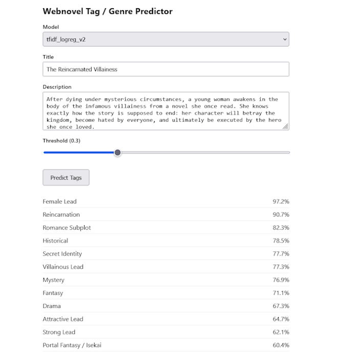

# Webnovel Tag / Genre Predictor

A machine-learning system for predicting genres and tags from webnovel titles and descriptions.

## Features

- Multi-label genre/tag prediction
- TF-IDF + One-vs-Rest Logistic Regression baseline
- Automatic discovery of .pkl models
- CLI training pipeline
- FastAPI backend with a lightweight frontend

## Interface

<p align="center">
  
</p>

## Setup

1. Install deps:
   ```
   pip install -r requirements.txt
   ```
2. Run:
   ```
   python uvicorn app:app --reload
   ```
3. Open http://127.0.0.1:8000

## Structure

```
webnovel-tag-predictor/
├── app.py                # FastAPI app and API routes
├── src/
│   ├── preprocessing.py  # shared text cleaning and tag parsing
│   ├── train.py          # CLI training pipeline
│   ├── predict.py        # prediction logic
│   └── registry.py       # model discovery, loading, and caching
├── models/               # trained .pkl model bundles
├── data/                 # put training CSVs here (optional)
├── static/               # frontend assets
└── requirements.txt      # dependencies
```

## Models

**Model 1**: TF-IDF + One-vs-Rest Logistic Regression v1

Dataset:

Metadata (titles,summaries,genres) from ~60,000 webnovels hosted on RoyalRoad. The dataset was collected using [novel-metadata-scraper](https://github.com/kevbot404/novel-metadata-scraper).

Pipeline:

1. **Text preprocessing**: Titles and descriptions are cleaned (lowercased, URLs removed, punctuation stripped, non-English text filtered out). The title is repeated 3x during feature construction to give it more weight than the description.
2. **Feature extraction**: TF-IDF vectorization with n-grams (1-3), sublinear TF scaling, `min_df=2`, and a vocabulary cap of 100,000 features.
3. **Classification**: Each tag/genre gets its own binary classifier. A threshold (default 0.30) controls how confident the model must be before predicting a tag.
4. **Train/test split**: Simple 80/20 split.
5. **Model bundle**: The trained vectorizer, classifier, label binarizer (`MultiLabelBinarizer`), and genre list are saved together as a single `.pkl` file.

**Model 2**: TF-IDF + One-vs-Rest Logistic Regression v2

Dataset:

Metadata (titles,summaries,genres) from ~150,000 webnovels hosted on RoyalRoad.
The dataset was collected using [novel-metadata-scraper](https://github.com/kevbot404/novel-metadata-scraper).

Pipeline:

1. **Text preprocessing**: Titles and descriptions are cleaned (lowercased, URLs removed, punctuation stripped, non-English text filtered out). Improved data cleaning from v1. The title is repeated 3x during feature construction to give it more weight than the description. Minimum tag count set to 1500.
2. **Feature extraction**: TF-IDF vectorization with n-grams (1-3), sublinear TF scaling, `min_df=2`, and a vocabulary cap of 100,000 features.
3. **Classification**: Each tag/genre gets its own binary classifier (`OneVsRestClassifier` wrapping a balanced `LogisticRegression` with `max_iter=2000`). A threshold (default 0.30) controls how confident the model must be before predicting a tag.
4. **Train/test split**: Uses `MultilabelStratifiedShuffleSplit` to preserve tag distribution in both splits.
5. **Model bundle**: The trained vectorizer, classifier, label binarizer (`MultiLabelBinarizer`), and genre list are saved together as a single `.pkl` file.

## Training from a CSV

Models can be trained directly from a CSV file.

```
python -m src.train --csv data/novels.csv --out models/webnovel_v2.pkl --min-tag-count 100
```

Example: Use data/novels.csv to train the model, keeping only tags that appear in at least 100 novels (rows), and save the trained model to models/webnovel_v2.pkl:

The CSV needs `title`, `description`, `tags` columns (tags pipe-separated,
e.g. `Romance|Fantasy|Isekai`).

### Training Options

| Flag              | Default      | Description                                             |
| ----------------- | ------------ | ------------------------------------------------------- |
| `--csv`           | _(required)_ | Path to the training CSV                                |
| `--out`           | _(required)_ | Path where the `.pkl` bundle will be saved              |
| `--test-size`     | `0.20`       | Fraction of data used for validation                    |
| `--seed`          | `42`         | Random seed for train/test split                        |
| `--min-tag-count` | `100`        | Minimum novel count a tag must appear in to be included |

## Frontend

The single-page frontend at `http://127.0.0.1:8000` provides:

- **Model selector**: Choose any model placed in `models/`
- **Title input**: The novel's title (optional but recommended)
- **Description input**: The novel's blurb/summary (optional but recommended)
- **Threshold slider**: Adjust prediction confidence cutoff from 0.05 to 0.90
- **Results panel**: Predicted tags shown with their probability percentages, sorted highest-first

### Tips for Good Results

- **Provide both title and description** for the most accurate predictions
- **Only use English characters** to not get garbage confidence scores
- **Lower the threshold** if no tags are returned (try 0.15-0.20)
- **Raise the threshold** if too many low-confidence tags are shown
- Train on a **larger, high-quality dataset** for better genre coverage
- Filter `min-tag-count` higher for a **focused genre set**

## API

### `GET /`

Serves the frontend.

### `GET /api/models`

Returns a list of available model names:

```json
{ "models": ["webnovel_v1", "webnovel_v2"] }
```

### `POST /api/predict`

Request body:

```json
{
  "model": "webnovel_v1",
  "title": "The Reincarnated Villainess",
  "description": "A young woman is reborn in a fantasy world...",
  "threshold": 0.3
}
```

Response:

```json
{
  "predictions": [
    { "tag": "Isekai", "probability": 0.89 },
    { "tag": "Fantasy", "probability": 0.76 },
    { "tag": "Romance", "probability": 0.42 }
  ]
}
```
